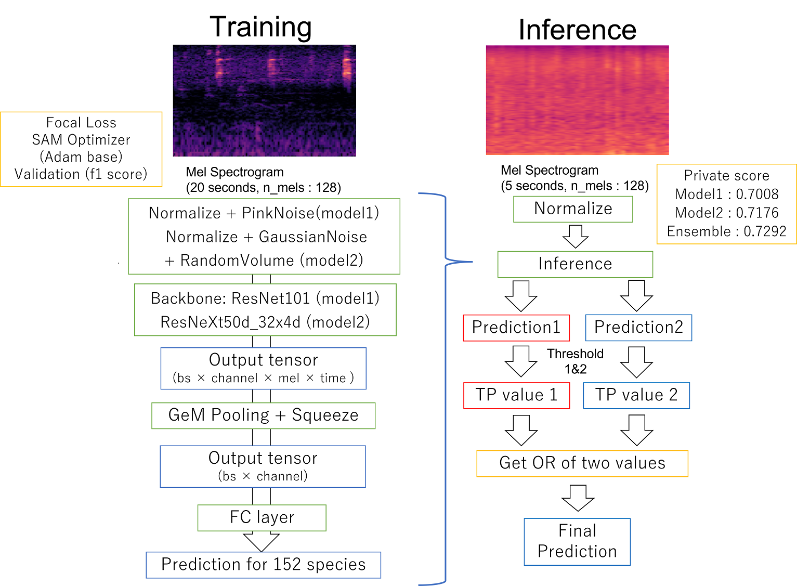

# Birdclef Experiment Repository & 50th Place Solution

このリポジトリはKaggle BirdCLEF 2022 Competition の実験用リポジトリかつ、50位の解法です。

## 結果
Rank: Public 44th →　Private 50 th (Silver medal)  
Score: Public 0.7812 → Private 0.7292
## コンペ概観

### 意識したこと
Kaggle での [discussion](https://www.kaggle.com/competitions/birdclef-2022/discussion/321668) にも投稿した通り、このコンペでは三つの側面を考慮する必要があったと考えています。

1. 高いCVスコアを出すこと  
これは当たり前ですが、より良いモデルを使用して、交差検証スコアを改善することが必要です。
HIDEHISA ARAI さんが2021年度の鳥コンペで公開したNotebook で使用されている PANNS の改良モデルを
使用した人が多かった印象です。自分もこのモデルを使用して、CV:0.789(f1 Score), Public:0.739, Private:0.711
まで行きましたが、途中からはResnet→GeM Pooling→MLPという手法に切り替え、CV:0.805(f1 Score), Public:0.7634, Private:0.7210まで向上させることができました(シングルモデルでのベスト)。

2. Domain Shift への対策  
CVは高いにも関わらずLBが低いモデルが複数ありました。これは恐らくTraining dataとTest data
の間にDomain Shiftが存在することが原因です。対策としては、雑音を挿入するAugmentationが
有効でした。特にGaussian Noise とPink Noise が有効に働き、これらを追加して訓練したモデルは
CVが悪化したもののPublic Score は改善しました。

3. 適切な閾値の選択  
今回、Test Soundscape(テストデータと同じ条件で集められたデータとそのラベル)が存在しなかったため、
閾値は手動で設定する必要がありました。この適切な閾値は大抵、モデルのValidationの段階で最適だった値と
はかけ離れていたため、手動でチューニングする必要がありました。チューニングと言っても、判断材料は
Public Scoreしか存在しなかったので、どうしてもPublic Scoreにオーバーフィットせざるを得ないという状況でした(にも関わらず、思ったよりShakeしなかったのは意外でした)。

### 対処できなかった点
1. 適切な交差検証を行うこと  
与えられたデータの関係上、Test dataと同条件で交差検証を行うことは不可能でした(Test Soundscapeが
ない & 評価指標が不透明であるため)。このため、Trust LBの姿勢を取らざるを得ませんでした。
2. 不均衡データへの対処
True と Falseの間の不均衡はFocal lossを使うことで対処できたと思っていますが、Species間での
データ数の違いが非常に大きいことに対処できたかは微妙でした。scored_birds(評価に使われる鳥)
とそれ以外の鳥で損失の重みを変える(FocalWeightedLossとしています)ということを考えましたが、
scored_birds内部での出現率の違いなどには対応できていないなど、詰めが甘い部分があり、効果があった
かは微妙です。

## 解法

 

### Single Model
図に示す通りです。鳴き声のデータを20secondで区切りメルスペクトログラムへと変換し、
Augmentation(Normalize, Pink Noise)を加えたものを入力とし、ResNet101dで特徴量
抽出を行いました(出力はbatch size ×　channel × frequency × time の四次元)。
その後、GeM poolingを用いてfrequencyとtime方向について特徴量を圧縮し、batch size × channel
の二次元テンソルに帰着させ、fc層を適用して152次元の出力を得ます。  
また、Augmentationとして0.25の確率でMixUpを適用しました。気持ち程度ですがモデルの頑健性が向上したと思っています。  
損失関数としてはBCEWithLogitsLossをベースとしたFocal lossを使用しました(https://www.kaggle.com/competitions/rfcx-species-audio-detection/discussion/213075)。  
また、OptimizerとしてはAdamをベースとしたSAM Optimizerを使用しました(https://github.com/davda54/sam)。
OptimizerをSAMに変えたことで、Sound Event Detection モデルに関しては、Optimizer以外の条件を揃えて実験したときのPublic Scoreは0.2ほど向上しました。

### Ensemble
出力された予測値のモデル毎平均を閾値に通すのではなく、閾値を通した後の真偽値の論理和や論理積を
最終的な予測結果として提出しました。論理和を取るアンサンブルを適用させることで、(Publicはほどんど変化
ありませんでしたが) Private score 0.7176と0.7008のモデルから、Privete score 0.7292の出力結果を
得ることができました。他のアンサンブルもCVとLBの間で乖離が少なかったので、有効に作用したと考えています。

### うまくいかなかった取り組み
Backbone として複雑なモデルを使用する(Swin Transformerなど)  
PaSST(https://github.com/kkoutini/PaSST)の使用  
得られた特徴量にMulti head attentionを無理やり適用する  
Arcface による深層距離学習(深層距離学習を使用できる問題設定ではないことに途中で気づく)  
Sound Event Triage Loss(https://arxiv.org/pdf/2204.06402.pdf )を使用する  
Psuedo label を用いる